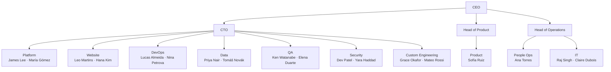

# Org Chart & Teams

Owner: People Ops (Ana Torres, @anat). Updated on every team change; source of truth for
"which team does X" questions. People details (contacts, expertise) live in the people directory.

## Org chart

## Team charters (one line each)

- **platform** — core services (auth, core-api, billing, notifications), architecture, on-call backbone. #platform
- **web** — marketing site + web app frontend, design system, performance, accessibility. #web
- **devops** — CI/CD, Kubernetes, Terraform, observability, deploys and rollbacks. #devops
- **data** — warehouse, pipelines, dashboards, event tracking, experimentation. #data-eng
- **qa** — test strategy, e2e suite, release sign-off, bug triage. #qa
- **security** — incident response, access control, vulnerability management, compliance. #security
- **custom-eng** — customer integrations and professional services on public APIs. #custom-eng
- **product** — roadmap, discovery, specs, outcome tracking. #product
- **people** — hiring, onboarding, benefits, growth frameworks. #people-ops
- **it** — accounts, laptops, SaaS administration, helpdesk. #it-helpdesk

## Which team owns my question?

- "My laptop/account/VPN…" → IT (#it-helpdesk)
- "Deploy/pipeline/alert…" → DevOps (#devops)
- "Is this a security thing?" → yes until Security says otherwise (#security-incidents)
- "Numbers on a dashboard look wrong" → Data (#data-eng)
- "A customer wants a custom integration" → Custom Engineering (#custom-eng)
- "Why does the product do X?" → Product (#product)
- "Benefits/payroll/time off" → People Ops (#people-ops)

## Working across teams

Cross-team asks go in the target team's channel (not DMs) with context and a deadline.
Anything contentious follows the RACI matrix; anything urgent follows Incident Management.
Each team's operational how-to lives in its runbook — the runbooks/ folder is the entry point.
