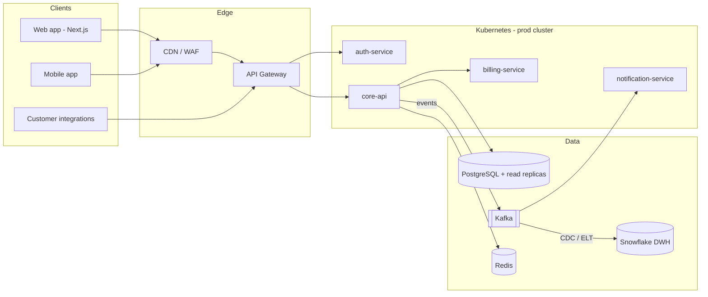
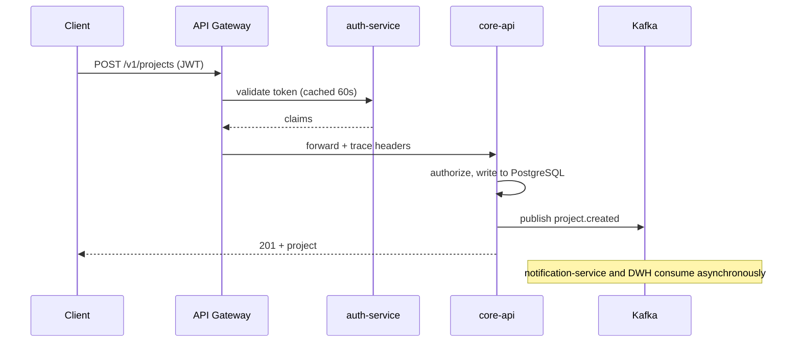
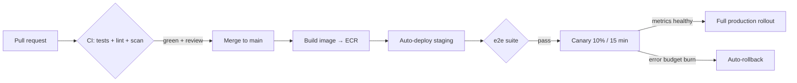

# Platform Architecture Overview

Owner: Platform team (María Gómez, @maria). Channel: #platform.
Diagrams are Mermaid — they render on GitHub, in VS Code, and at https://mermaid.live.

## System context

The platform is a set of services behind an API gateway, deployed on Kubernetes (EKS).
PostgreSQL is the system of record, Kafka carries domain events, Redis handles caching
and rate limiting. The marketing site and web app are separate Next.js deployments on Vercel.

## Service responsibilities

- **auth-service** — sessions, tokens, SSO (Okta SAML/OIDC), API keys. Owns the `users` schema.
- **core-api** — the domain: workspaces, projects, documents. Everything else hangs off it.
- **billing-service** — subscriptions and invoicing; wraps Stripe, emits `invoice.*` events.
- **notification-service** — consumes Kafka events, fans out to email/Slack/webhooks.

Rule of thumb: services communicate synchronously through the gateway *or* asynchronously
via Kafka events — never by reaching into another service's database.

## Request lifecycle

## Deployment pipeline

Details: DevOps Runbook (promotion, rollback, freeze windows).

## Cross-cutting decisions (ADRs)

Architecture Decision Records live in `company/architecture/adr/` — one file per decision,
never edited after acceptance, superseded by a new ADR instead. Start with
ADR-001 (event schema versioning), ADR-007 (multi-tenancy via schema-per-tenant rejected),
and ADR-012 (why the gateway owns authn but services own authz).

## Non-functional targets

Availability 99.9%/month per public service · p95 API latency < 300 ms ·
RPO 5 min / RTO 1 h (cross-region PostgreSQL replicas) · all data encrypted in transit and at rest.
