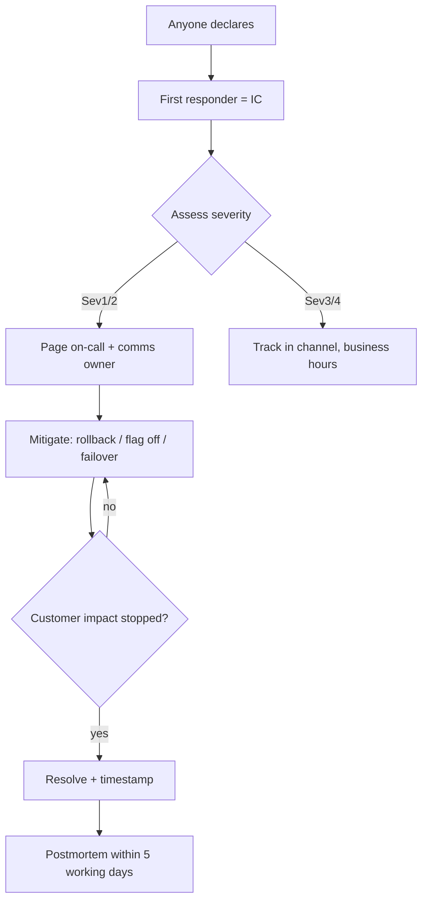

# Incident Management

Owner: Platform + DevOps (María Gómez, @maria · Nina Petrova, @ninap). Channel: #incidents.
Principle: fix the customer first, learn second, blame never.

## Severity levels

- **Sev1** — product down, data loss, or active security breach. Page immediately, all hands.
- **Sev2** — core flow broken for many customers, no workaround. Page on-call.
- **Sev3** — degraded with workaround. Business hours response.
- **Sev4** — minor, cosmetic. Normal backlog.

When unsure, pick the higher severity. Downgrading later is free; upgrading late is not.

## Declaring an incident

Anyone can declare — you don't need permission:

1. Run `/incident declare` in Slack (creates `#inc-YYYYMMDD-<slug>`, pages on-call, starts the timeline bot).
2. State what you see, impact, and when it started. Facts first, theories clearly labeled as theories.
3. The first responder is Incident Commander (IC) until handed off explicitly.

## Roles

- **IC** coordinates and decides; ICs don't type fixes. Handoff is explicit: "@ninap you have command."
- **Comms owner** posts status-page and internal updates every 30 min for Sev1/2 — even "no change".
- **Responders** work the problem and narrate what they try in the channel (the timeline is evidence).

## Mitigation before diagnosis

Rollback, feature-flag off, shed load, fail over — stop the bleeding with the reversible
option first. Root cause is for the postmortem; the incident channel is for making impact stop.
The DevOps Runbook has the rollback commands; kill switches are listed in `flags.yaml`.

## Blameless postmortems

Within 5 working days, the IC owns the write-up (template: `company/postmortems/TEMPLATE.md`):
timeline, impact, contributing causes (plural — there is never exactly one), what went well,
and action items with owners and dates. Action items go on the owning team's board —
a postmortem without landed actions is a story, not a fix.

We name systems and decisions, not people. "The deploy pipeline allowed an unreviewed
config change" — not "Lucas skipped review". People acting reasonably on the information
they had is the assumption; if that assumption fails, it's a management conversation, not a postmortem.

## On-call

Engineers join the rotation after their first 90 days, always shadowing first.
Being paged is not an emergency you caused; it's the system asking for help.
Pages outside working hours earn recovery time the next morning — take it.
